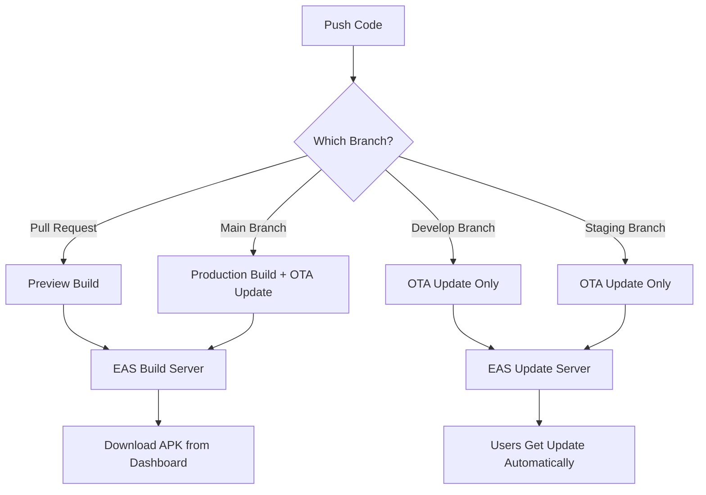

# 🚀 EAS Build & Update Workflows Documentation

## Overview

This project uses **EAS (Expo Application Services)** with **GitHub Actions** for automated builds and Over-The-Air (OTA) updates. The workflows are triggered automatically based on your Git operations.

---

## 📋 Table of Contents

- [Workflows Overview](#workflows-overview)
- [Setup Instructions](#setup-instructions)
- [How It Works](#how-it-works)
- [Workflow Details](#workflow-details)
- [Manual Triggers](#manual-triggers)
- [Troubleshooting](#troubleshooting)

---

## 🔄 Workflows Overview

### 1. **Preview Build** (`preview.yml`)

- **Trigger**: Automatically on Pull Requests to `main` or `develop` branches
- **Purpose**: Build preview APKs for testing before merging
- **Platform**: Android
- **Output**: APK file available on EAS Dashboard

### 2. **Production Build** (`production.yml`)

- **Trigger**: Automatically on push to `main` branch or version tags
- **Purpose**: Build production-ready applications
- **Platform**: Android (configurable for iOS)
- **Output**: Production APK, GitHub Release (for tags)

### 3. **EAS Update (OTA)** (`update.yml`)

- **Trigger**: Automatically on push to `main`, `develop`, or `staging` branches
- **Purpose**: Deploy JavaScript/asset updates without full rebuild
- **Platform**: All platforms with compatible builds
- **Output**: OTA update available immediately to users

---

## 🛠 Setup Instructions

### Prerequisites

1. **Expo Account**: Sign up at [expo.dev](https://expo.dev)
2. **EAS CLI**: Already configured in your project
3. **GitHub Repository**: Your code must be on GitHub

### Step 1: Create Expo Access Token

1. Visit [Expo Access Tokens](https://expo.dev/accounts/[your-account]/settings/access-tokens)
2. Click **"Create Token"**
3. Name: `GitHub Actions CI/CD`
4. Permissions: **Read & Write**
5. Copy the generated token (you won't see it again!)

### Step 2: Add GitHub Secrets

1. Go to your GitHub repository
2. Navigate to **Settings** → **Secrets and variables** → **Actions**
3. Click **"New repository secret"**
4. Add the following secrets:

| Secret Name              | Value                                       | Description             |
| ------------------------ | ------------------------------------------- | ----------------------- |
| `EXPO_TOKEN`             | `your-expo-access-token`                    | Token from Step 1       |
| `EXPO_PUBLIC_CONVEX_URL` | `https://festive-seahorse-929.convex.cloud` | Your Convex backend URL |

### Step 3: Verify Configuration

1. Check your [eas.json](eas.json) has channels configured (✅ Already done)
2. Ensure your repository is connected to GitHub
3. Push a test commit to trigger workflows

---

## ⚙️ How It Works

### Automatic Triggers



### Build vs Update Decision

**Full Build Required When:**

- Native code changes (Android/iOS modules)
- Dependencies with native code added/updated
- Build configuration changes
- First time deployment

**OTA Update Sufficient When:**

- JavaScript/TypeScript code changes
- React component updates
- Asset changes (images, fonts)
- Styling changes

---

## 📝 Workflow Details

### Preview Build Workflow

**File**: `.github/workflows/preview.yml`

**Triggers:**

- Opening a Pull Request to `main` or `develop`
- Pushing new commits to an open PR
- Reopening a closed PR

**What It Does:**

1. ✅ Checks out your code
2. ✅ Sets up Node.js and EAS CLI
3. ✅ Installs dependencies
4. ✅ Starts Android preview build
5. ✅ Comments on PR with build link

**After Workflow Runs:**

- Check the PR for a comment with the build link
- Visit [EAS Dashboard](https://expo.dev) to monitor build progress
- Download APK when build completes (~5-15 minutes)

---

### Production Build Workflow

**File**: `.github/workflows/production.yml`

**Triggers:**

- Push to `main` branch
- Creating a tag (e.g., `v1.0.1`)
- Manual trigger from GitHub Actions tab

**What It Does:**

1. ✅ Checks out your code
2. ✅ Sets up Node.js and EAS CLI
3. ✅ Installs dependencies
4. ✅ Starts production build
5. ✅ Creates GitHub Release (if triggered by tag)

**After Workflow Runs:**

- Visit [EAS Dashboard](https://expo.dev) to download production APK
- For tagged releases, find APK link in GitHub Releases

---

### EAS Update (OTA) Workflow

**File**: `.github/workflows/update.yml`

**Triggers:**

- Push to `main` → Production channel
- Push to `develop` → Preview channel
- Push to `staging` → Staging channel
- Manual trigger with custom channel

**What It Does:**

1. ✅ Checks out your code
2. ✅ Sets up Node.js and EAS CLI
3. ✅ Installs dependencies
4. ✅ Determines update channel based on branch
5. ✅ Publishes OTA update to appropriate channel

**After Workflow Runs:**

- Users on the same channel will receive the update on next app launch
- No app store submission required
- Updates are nearly instant

**Note**: OTA updates are skipped if:

- Changes are made to native Android/iOS code
- Changes are in `.github/`, markdown files, or `eas.json`

---

## 🎯 Manual Triggers

### Trigger Production Build Manually

1. Go to **Actions** tab in your GitHub repository
2. Select **"EAS Production Build"** workflow
3. Click **"Run workflow"**
4. Choose platform (Android/iOS/All)
5. Click **"Run workflow"**

### Trigger OTA Update Manually

1. Go to **Actions** tab in your GitHub repository
2. Select **"EAS Update (OTA)"** workflow
3. Click **"Run workflow"**
4. Choose channel (production/preview/development)
5. Add optional update message
6. Click **"Run workflow"**

---

## 🔍 Monitoring Builds & Updates

### EAS Dashboard

Visit [expo.dev](https://expo.dev/accounts/[your-account]/projects/zenith-task) to:

- Monitor build progress
- Download build artifacts (APK/IPA)
- View update history
- Check update analytics
- Debug failed builds

### GitHub Actions

Visit your repository's **Actions** tab to:

- See workflow run history
- View logs for each step
- Debug workflow failures
- Re-run failed workflows

---

## 🐛 Troubleshooting

### Build Fails with "Invalid Credentials"

**Problem**: EXPO_TOKEN is missing or invalid

**Solution**:

1. Generate a new token at [expo.dev/settings/access-tokens](https://expo.dev/settings/access-tokens)
2. Update the `EXPO_TOKEN` secret in GitHub
3. Re-run the workflow

---

### OTA Update Not Reaching Users

**Problem**: Users aren't getting the update

**Solutions**:

1. Check the update was published to the correct channel
2. Ensure users' builds are configured for that channel
3. Users must restart the app to check for updates
4. Check [EAS Dashboard](https://expo.dev) for update status

---

### Build Takes Too Long

**Normal Build Times**:

- Preview build: 5-15 minutes
- Production build: 10-20 minutes
- OTA update: 2-5 minutes

**If Slower**:

1. Check EAS Dashboard for queue position
2. Free tier has limited concurrent builds
3. Consider [EAS Build plans](https://expo.dev/pricing) for faster builds

---

### Workflow Not Triggering

**Check**:

1. Workflow files are in `.github/workflows/` directory
2. You have write permissions to the repository
3. GitHub Actions are enabled (Settings → Actions)
4. Branch names match the workflow triggers

---

## 📱 Update Channels Explained

Your app uses different channels for different environments:

| Channel         | Purpose            | Auto-triggered by | Users                |
| --------------- | ------------------ | ----------------- | -------------------- |
| **production**  | Live users         | Push to `main`    | Production app users |
| **preview**     | Testing/QA         | Push to `develop` | Internal testers     |
| **staging**     | Pre-production     | Push to `staging` | Staging environment  |
| **development** | Active development | Manual trigger    | Developers only      |

Each build is linked to a channel, and OTA updates are delivered only to builds on matching channels.

---

## 🎨 Customization

### Add iOS Support

Edit `.github/workflows/production.yml` and `.github/workflows/preview.yml`:

```yaml
- name: 🚀 Build iOS Production
  run: eas build --platform ios --profile production --non-interactive
```

### Change Trigger Branches

Edit the workflow files and modify:

```yaml
on:
  push:
    branches:
      - your-branch-name
```

### Add Notifications

Add Slack/Discord notifications by adding notification steps to workflows.

---

## 📚 Additional Resources

- [EAS Build Documentation](https://docs.expo.dev/build/introduction/)
- [EAS Update Documentation](https://docs.expo.dev/eas-update/introduction/)
- [GitHub Actions Documentation](https://docs.github.com/en/actions)
- [Expo Dashboard](https://expo.dev)

---

## ✅ What You've Accomplished

- ✅ Automated preview builds on Pull Requests
- ✅ Automated production builds on main branch
- ✅ Automated OTA updates on code changes
- ✅ Multi-channel update distribution
- ✅ GitHub integration for releases
- ✅ No manual build commands needed

**You're all set! 🎉** Just push your code and let the workflows handle the rest.
